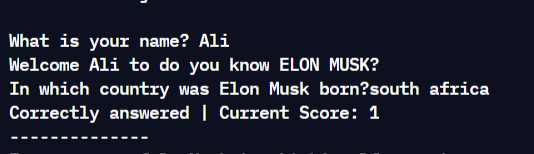

## CLI Quiz App on ELON MUSK, Made with JavaScript.
   
   
It is developed in JavaScript on [https://replit.com/](https://replit.com/@aliarslanansari/markOne-Quiz-CLI-App?v=1) in Node.js environment.

#### Packages Used
- readline-sync : for taking user input on CLI

#### Features 
- Takes User's Name as Input
- Has Ability to check highscores
- Ask multiple questions, check answer is correct or not

#### Screenshot
